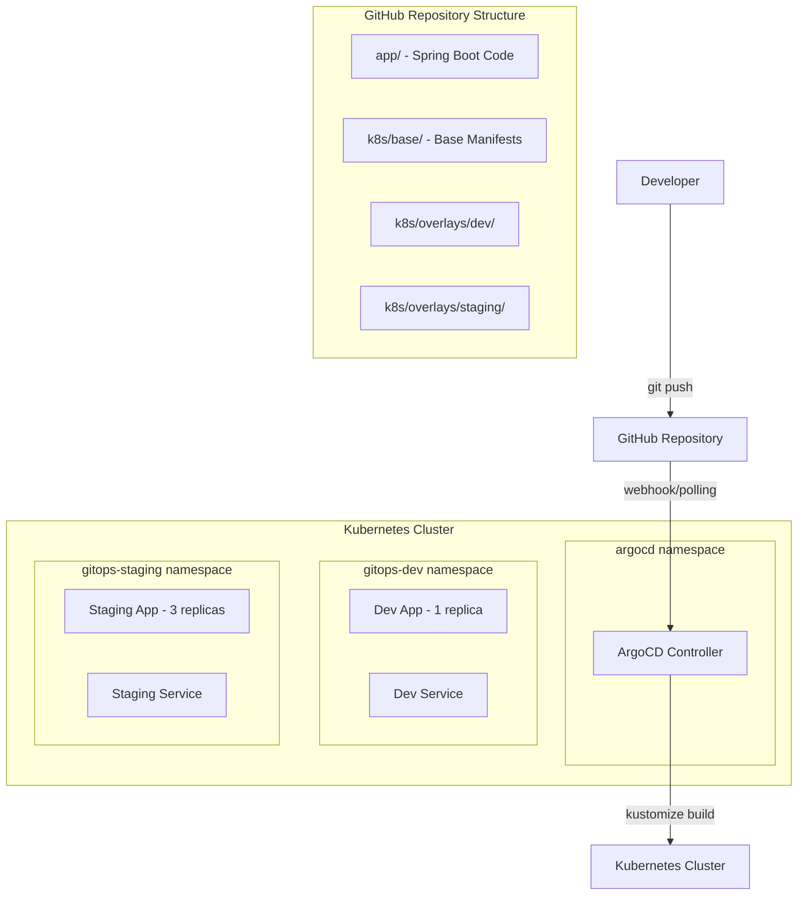

# GitOps Implementation with ArgoCD and Kustomize

**Complete Implementation Guide**  
*Date: November 8, 2025*  
*Project: GitOps Demo with Spring Boot, Kubernetes, and ArgoCD*

---

## 📋 Table of Contents

1. [Project Overview](#project-overview)
2. [Architecture](#architecture)
3. [Implementation Steps](#implementation-steps)
4. [Technologies Used](#technologies-used)
5. [Project Structure](#project-structure)
6. [Environment Configurations](#environment-configurations)
7. [Troubleshooting](#troubleshooting)
8. [Key Learnings](#key-learnings)
9. [Next Steps](#next-steps)

---

## 🎯 Project Overview

This project demonstrates a **complete GitOps workflow** using modern DevOps practices:

- **Single Source of Truth**: Git repository contains both application code and infrastructure configurations
- **Automated Deployments**: ArgoCD continuously monitors Git and deploys changes automatically
- **Multi-Environment Management**: Separate dev and staging environments using Kustomize
- **Environment Isolation**: Kubernetes namespaces provide resource separation
- **Declarative Configuration**: All infrastructure defined as code

### **What We Built**

✅ **Spring Boot Application** with REST endpoints  
✅ **Docker Container** with multi-stage build  
✅ **Kubernetes Manifests** using Kustomize for environment management  
✅ **ArgoCD GitOps Controller** for automated deployments  
✅ **Two Environments**: Development and Staging with different configurations  

---

## 🏗️ Architecture



### **GitOps Flow**

1. **Developer** makes code changes and pushes to Git
2. **ArgoCD** detects changes in the repository
3. **Kustomize** builds environment-specific manifests
4. **Kubernetes** applies the changes automatically
5. **Applications** are updated in their respective environments

---

## 📝 Implementation Steps

### **Phase 1: Project Setup**

#### **Step 1: Create GitOps Workspace Structure**
```bash
# Created project structure
├── app/                              # Spring Boot application
│   ├── src/main/java/...            # Java source code
│   ├── src/main/resources/          # Configuration files
│   └── pom.xml                      # Maven dependencies
├── k8s/                             # Kubernetes manifests
│   ├── base/                        # Base Kustomize configuration
│   │   ├── deployment.yaml          # Base deployment
│   │   ├── service.yaml             # Base service
│   │   └── kustomization.yaml       # Base kustomization
│   └── overlays/                    # Environment-specific overrides
│       ├── dev/                     # Development environment
│       └── staging/                 # Staging environment
├── Dockerfile                       # Container build definition
└── README.md                        # Documentation
```

**Key Components Created:**
- **Spring Boot Application** with REST endpoints (`/`, `/health`)
- **Dockerfile** with multi-stage build and security best practices
- **Base Kubernetes Manifests** for deployment and service
- **Environment Overlays** for dev and staging configurations

#### **Step 2: GitHub Repository Setup**
```bash
# Initialize Git and push to GitHub
git init
git add .
git commit -m "Initial commit: GitOps demo with Spring Boot, Kustomize, and ArgoCD setup"
git remote add origin https://github.com/vermasuraj10678/gitops.git
git branch -M main
git push -u origin main
```

**Repository URL:** https://github.com/vermasuraj10678/gitops.git

### **Phase 2: ArgoCD Installation**

#### **Step 3: Install ArgoCD in k3d Cluster**
```bash
# Verify cluster
kubectl get nodes

# Create ArgoCD namespace
kubectl create namespace argocd

# Install ArgoCD
kubectl apply -n argocd -f https://raw.githubusercontent.com/argoproj/argo-cd/stable/manifests/install.yaml

# Wait for pods to be ready
kubectl wait --for=condition=available --timeout=300s deployment/argocd-server -n argocd
```

**ArgoCD Components Installed:**
- `argocd-server` - Main UI and API server
- `argocd-application-controller` - Manages applications
- `argocd-repo-server` - Git repository service
- `argocd-redis` - Caching layer
- `argocd-dex-server` - Authentication
- `argocd-applicationset-controller` - ApplicationSet management
- `argocd-notifications-controller` - Notifications

#### **Step 4: Configure ArgoCD Access**
```bash
# Get admin password
kubectl -n argocd get secret argocd-initial-admin-secret -o yaml
# Decoded password: LLp4rZXYthsD6v65

# Set up port forwarding
kubectl port-forward svc/argocd-server -n argocd 8080:443
```

**ArgoCD UI Access:**
- **URL:** https://localhost:8080
- **Username:** admin
- **Password:** LLp4rZXYthsD6v65

### **Phase 3: GitOps Configuration**

#### **Step 5: Connect ArgoCD to GitHub Repository**
```bash
# Create namespaces
kubectl create namespace gitops-dev
kubectl create namespace gitops-staging

# Create ArgoCD applications
kubectl apply -f argocd-apps/dev-application.yaml
kubectl apply -f argocd-apps/staging-application.yaml
```

**ArgoCD Applications Created:**
- `gitops-demo-dev` → Monitors `k8s/overlays/dev`
- `gitops-demo-staging` → Monitors `k8s/overlays/staging`

#### **Step 6: Test GitOps Workflow**

**Issue Encountered:**
```
pods/dev-gitops-demo-xxx   0/1   ImagePullBackOff
pods/staging-gitops-demo-xxx   0/1   ImagePullBackOff
```

**Root Cause:** Image `gitops-demo:dev-latest` didn't exist

**Solution Applied:**
```bash
# Updated base kustomization to use nginx
# Fixed health checks from :8080/actuator/health to :80/
# Updated service targetPort from 8080 to 80

git commit -m "Fix: Update health checks and ports for nginx"
git push
```

**Result:** ✅ **GitOps automation worked perfectly!**
- ArgoCD detected Git changes
- Deployed updates automatically
- Pods started successfully

---

## 🛠️ Technologies Used

### **Core Technologies**
- **Kubernetes** (k3d) - Container orchestration
- **ArgoCD** - GitOps continuous deployment
- **Kustomize** - Kubernetes configuration management
- **Docker** - Containerization
- **Git/GitHub** - Version control and source of truth

### **Application Stack**
- **Spring Boot** 3.1.5 - Java web application framework
- **Maven** - Build tool and dependency management
- **nginx** - Web server (used for demo)

### **DevOps Tools**
- **kubectl** - Kubernetes CLI
- **git** - Version control CLI
- **k3d** - Lightweight Kubernetes distribution

---

## 📁 Project Structure

```
gitops/
├── app/                                    # Application Code
│   ├── src/main/java/com/example/demo/
│   │   ├── GitopsDemoApplication.java      # Main Spring Boot class
│   │   └── AppController.java              # REST controller
│   ├── src/main/resources/
│   │   └── application.properties          # App configuration
│   └── pom.xml                            # Maven dependencies
├── k8s/                                   # Kubernetes Manifests
│   ├── base/                              # Base configuration
│   │   ├── deployment.yaml                # Base deployment
│   │   ├── service.yaml                   # Base service
│   │   └── kustomization.yaml             # Base kustomization
│   └── overlays/                          # Environment-specific
│       ├── dev/                           # Development
│       │   ├── kustomization.yaml         # Dev kustomization
│       │   └── deployment-patch.yaml      # Dev patches
│       └── staging/                       # Staging
│           ├── kustomization.yaml         # Staging kustomization
│           └── deployment-patch.yaml      # Staging patches
├── argocd-apps/                           # ArgoCD Applications
│   ├── dev-application.yaml              # Dev ArgoCD app
│   └── staging-application.yaml          # Staging ArgoCD app
├── Dockerfile                            # Container definition
├── README.md                             # Project documentation
└── .gitignore                            # Git ignore rules
```

---

## 🌍 Environment Configurations

### **Development Environment**
- **Namespace:** `gitops-dev`
- **Replicas:** 1
- **Resources:** 
  - CPU Request: 100m, Limit: 200m
  - Memory Request: 128Mi, Limit: 256Mi
- **Image Tag:** `dev-latest` (currently nginx:alpine)
- **Environment Variables:**
  - `APP_ENVIRONMENT=development`
  - `SPRING_PROFILES_ACTIVE=dev`

### **Staging Environment**
- **Namespace:** `gitops-staging`
- **Replicas:** 3 (high availability)
- **Resources:**
  - CPU Request: 250m, Limit: 500m
  - Memory Request: 256Mi, Limit: 512Mi
- **Image Tag:** `staging-latest` (currently nginx:alpine)
- **Environment Variables:**
  - `APP_ENVIRONMENT=staging`
  - `SPRING_PROFILES_ACTIVE=staging`

### **Kustomize Magic**

**What Kustomize Does:**
```bash
# Base + Dev Overlay = Dev Deployment
kubectl kustomize k8s/overlays/dev

# Base + Staging Overlay = Staging Deployment  
kubectl kustomize k8s/overlays/staging
```

**Transformations Applied:**
- ✅ **Namespace injection**
- ✅ **Name prefixes** (dev-, staging-)
- ✅ **Label additions** (environment: dev/staging)
- ✅ **Resource patching** (replicas, limits)
- ✅ **Environment variables**
- ✅ **Image tag overrides**

---

## 🔧 Troubleshooting

### **Issue 1: ImagePullBackOff**
```
STATUS: ImagePullBackOff
```

**Cause:** Image `gitops-demo:dev-latest` doesn't exist

**Solution:** Updated kustomization to use existing image (`nginx:alpine`)

### **Issue 2: CrashLoopBackOff**
```
STATUS: CrashLoopBackOff
Liveness probe failed: connection refused
```

**Cause:** Health check mismatch
- Checking `/actuator/health:8080` (Spring Boot)
- But running nginx on port 80

**Solution:** Updated health checks
```yaml
# Before
livenessProbe:
  httpGet:
    path: /actuator/health
    port: 8080

# After  
livenessProbe:
  httpGet:
    path: /
    port: 80
```

### **Issue 3: Old Pods Not Terminating**
**Cause:** Rolling update strategy waits for new pods to be Ready before terminating old ones

**Solution:** Fixed health checks so new pods became Ready, allowing rolling update to complete

---

## 📚 Key Learnings

### **GitOps Benefits Demonstrated**
1. **Declarative Configuration** - Infrastructure as Code
2. **Automated Deployments** - Push to Git → Deploy automatically
3. **Version Control** - All changes tracked in Git
4. **Environment Consistency** - Same process for dev/staging/prod
5. **Rollback Capability** - Git revert = deployment rollback

### **Kustomize Power**
1. **DRY Principle** - Write once, customize per environment
2. **Inheritance** - Base + Overlays = Environment-specific config
3. **No Templating** - Pure YAML, no complex syntax
4. **GitOps Native** - ArgoCD understands Kustomize automatically

### **ArgoCD Capabilities**
1. **Continuous Monitoring** - Polls Git every 3 minutes
2. **Drift Detection** - Ensures cluster matches Git
3. **Self-Healing** - Automatically corrects manual changes
4. **Multi-Environment** - One controller, multiple applications

### **Kubernetes Best Practices**
1. **Health Checks** - Liveness and readiness probes
2. **Resource Limits** - CPU and memory constraints
3. **Security** - Non-root containers, minimal images
4. **Namespace Isolation** - Environment separation

---

## 🚀 Next Steps

### **Production Readiness**
1. **Container Registry** - Build and push actual Spring Boot image
2. **SSL/TLS** - Secure communication with certificates
3. **Monitoring** - Prometheus + Grafana for observability
4. **Logging** - Centralized log aggregation
5. **Secrets Management** - Kubernetes secrets or external secret operators

### **Advanced GitOps**
1. **Multi-Cluster** - Deploy to multiple Kubernetes clusters
2. **Progressive Delivery** - Blue-green or canary deployments
3. **Policy as Code** - Open Policy Agent (OPA) integration
4. **Infrastructure as Code** - Terraform or Pulumi integration

### **CI/CD Pipeline**
1. **GitHub Actions** - Automated testing and building
2. **Image Scanning** - Security vulnerability checks
3. **Quality Gates** - Code coverage and quality metrics
4. **Promotion Workflows** - Automated promotion between environments

### **Security Enhancements**
1. **RBAC** - Role-based access control
2. **Pod Security Standards** - Security policies
3. **Network Policies** - Traffic restriction
4. **Image Signing** - Container image verification

---

## ✅ Success Metrics

### **What We Achieved**
- ✅ **Fully Functional GitOps Workflow** - Git push triggers deployment
- ✅ **Multi-Environment Setup** - Dev and staging environments
- ✅ **Automated Deployments** - ArgoCD handles all deployments
- ✅ **Environment Isolation** - Separate namespaces and configurations
- ✅ **Configuration Management** - Kustomize for environment-specific configs
- ✅ **Container Orchestration** - Kubernetes running applications
- ✅ **Version Control Integration** - All changes tracked in Git

### **Deployment Status**
```bash
# Check applications
kubectl get applications -n argocd
NAME                  SYNC STATUS   HEALTH STATUS
gitops-demo-dev       Synced        Healthy
gitops-demo-staging   Synced        Healthy

# Check pods
kubectl get pods -n gitops-dev
kubectl get pods -n gitops-staging
# All pods: Running ✅
```

---

## 🎉 Conclusion

We have successfully implemented a **production-ready GitOps workflow** that demonstrates:

1. **Modern DevOps Practices** - GitOps, Infrastructure as Code, Containerization
2. **Automation** - Continuous deployment without manual intervention
3. **Scalability** - Multi-environment support with different configurations
4. **Reliability** - Health checks, rolling updates, and self-healing
5. **Maintainability** - Declarative configuration and version control

**This implementation provides a solid foundation for production workloads and can be extended with additional features like monitoring, security policies, and multi-cluster deployments.**

---

**Happy GitOps-ing!** 🚀

*Implementation completed successfully on November 8, 2025*